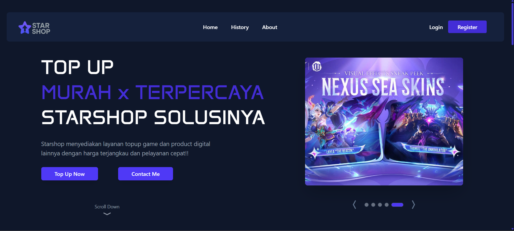

# 🚀 Starshop - Digital Product Top-Up Platform



**Your one-stop destination for seamless game credits top-up.**
  *Fast, Secure, and Managed with a powerful Admin Dashboard.*

🔗 **Live Demo:** [https://starshop-jf2g.vercel.app/](https://starshop-jf2g.vercel.app/)

---

## 🛠️ Tech Stack

This project leverages the latest web technologies for optimal performance and developer experience:

-   **Framework:** [Next.js 14/15 (App Router)](https://nextjs.org/)
-   **Language:** [TypeScript](https://www.typescriptlang.org/)
-   **Styling:** [Tailwind CSS](https://tailwindcss.com/)
-   **Icons:** [Lucide React](https://lucide.dev/) & [React Icons](https://react-icons.github.io/react-icons/)
-   **Deployment:** [Vercel](https://vercel.com/)

---

## ✨ Key Features

### 👤 For Users
-   **🛒 Browsing & Search:** Easy to find games with category filtering.
-   **💳 Seamless Checkout:** Input User ID, select nominal, and choose payment method.
-   **upload Proof:** Integrated image uploader with preview for payment proof.
-   **History Tracker:** Authenticated users can see their purchase history.
-   **📱 Responsive Design:** Optimized for Mobile and Desktop (Sidebar/Navbar adaptive).
-   **🔐 Secure Auth:** Login & Register system powered by Supabase Auth.

### 🛡️ For Admins (Dashboard)
-   **📊 Product Management:** CRUD (Create, Read, Update, Delete) products.
-   **🔍 Search & Filter:** Quickly find transactions or products by ID/Name.
-   **🖼️ News Management:** Handle CRUD ffor News at Landing Page.
-   **📈 Real-time Updates:** Changes in dashboard reflect instantly via Supabase.

---

## 📂 Project Structure

The project follows a "Clean Code" structure to ensure scalability:

```bash
root
├── src/
│    ├── app/
│    │   ├── (auth)/             # Login & Register Routes
│    │   ├── Topup/              # Topup Logic & Components
│    │   ├── dashboard/          # Admin Panel (product, etc.)
│    │   ├── lib/                # Supabase Client & Utils
│    │   ├── History/            # History Page (access for auth user)
│    │   └── Home/               # Home Landing Page
│    ├── components/
│    │   ├── modals/             # ProductEditModal, NewProductModal, ContactModal, etc
│    │   ├── ui/                 # Atomic UI (Buttons, Inputs, ImageUploader)
│    │   └── ...                 # Feature-specific components
│    ├── datatypes/              # TypeScript Interfaces (Product, PaymentMethod)
│    ├── hooks/                  # Custom Hooks (useModal, useAuth)
│    └── public/                 # Static Assets
└── ...

```

---

## 🚀 Getting Started Locally

Follow these steps to run the project on your local machine:

1. **Clone the repository**
```bash
git clone [https://github.com/ak7prisma/starshop.git](https://github.com/ak7prisma/starshop.git)
cd portfolio-ahmad-kurnia-prisma

```

2. **Install Dependencies**
```bash
npm install
# or
yarn install

```

3. **Setup Environment Variables**

Create a .env.local file in the root directory and add your Supabase credentials:

 ```bash
NEXT_PUBLIC_SUPABASE_URL=your_supabase_project_url
NEXT_PUBLIC_SUPABASE_ANON_KEY=your_supabase_anon_key
```

4. **Run Development Server**
```bash
npm run dev

```

5. **Open in Browser**
Visit `http://localhost:3001` to see the app in action.

---

## 📬 Contact

Feel free to reach out if you want to collaborate or just say hi!

* **Email:** ahmadkurniaprisma@gmail.com
* **LinkedIn:** [Ahmad Kurnia Prisma](https://www.google.com/search?q=https://www.linkedin.com/in/ahmad-kurnia-prisma-1b639a313)
* **Instagram:** [@akprisma](https://www.google.com/search?q=https://www.instagram.com/akprisma)

---

Developed by **Ahmad Kurnia Prisma**

```

```